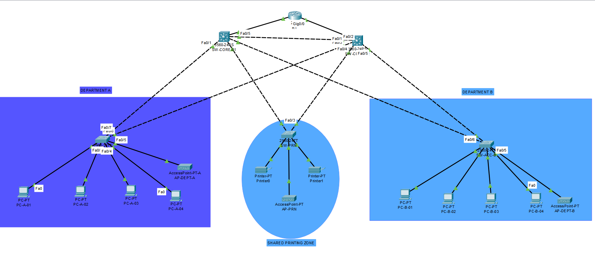

# CMPG 325 – Kopano Community Bank (Mahikeng)

Individual semester project for **CMPG 325 – Computer Networks** (NWU).
Packet Tracer design and implementation of a campus LAN for a community bank, with **STP loop prevention and root design** as the assigned networking challenge.

| Item | Detail |
|---|---|
| Student | CHABA, T |
| Project ID / Client ID | CMPG325-2026-008 / CLI-008 |
| Client | Kopano Community Bank (Mahikeng), Banking & Finance |
| Addressing block | 10.14.0.0/16 |
| Assigned challenge | STP (loop prevention & root design) |
| Change request | CR8 – a shared printer zone must serve two departments that currently cannot print |
| Constraint | A branch office may open within 18 months; the addressing plan must allow it |

## Network overview

- **R1** (Cisco 2911): edge router, routed /30 links to both core switches.
- **SW-CORE-01 / SW-CORE-02** (3560-24PS): redundant core. SW-CORE-01 is the STP root and HSRP active gateway; SW-CORE-02 is the backup root and standby gateway.
- **SW-ACC-A, SW-ACC-B, SW-PRN** (2960-24TT): access switches for Department A, Department B and the shared printer zone. Each has an uplink to both cores.

### VLANs and addressing

| VLAN | Purpose | Subnet | Gateway (HSRP virtual IP) |
|---|---|---|---|
| 10 | Department A | 10.14.10.0/24 | 10.14.10.1 |
| 20 | Department B | 10.14.20.0/24 | 10.14.20.1 |
| 30 | Shared printer zone | 10.14.30.0/24 | 10.14.30.1 |
| 99 | Management | 10.14.99.0/24 | 10.14.99.1 |

Router links: `10.14.0.0/30` (R1 to SW-CORE-01) and `10.14.0.4/30` (R1 to SW-CORE-02).
The full plan, including host addresses, is in [docs/addressing-plan.md](docs/addressing-plan.md).

### Future branch office

`10.14.128.0/17` (the top half of the assigned block) is reserved for the branch. The current site uses only `10.14.0.0/17`, so each site can be summarised with a single route and nothing needs renumbering when the branch opens.

## Assigned challenge: STP

- Rapid-PVST+ on all switches.
- SW-CORE-01 priority 4096 (primary root), SW-CORE-02 priority 8192 (secondary root), access switches default.
- Every access switch forwards on its uplink to SW-CORE-01 and blocks its uplink to SW-CORE-02, which removes the Layer 2 loops while keeping the redundant path.
- PortFast and BPDU Guard on host ports; trunks use native VLAN 99 with pruned allowed VLANs.

Details and verification: [docs/stp-design.md](docs/stp-design.md).

## CR8: shared printer zone

The printers sit in their own segment (VLAN 30) on SW-PRN. SW-CORE-01 routes between VLANs 10, 20 and 30, so both departments can print through the 10.14.30.1 gateway.

## How to open and test

1. Open `packet-tracer/project325.pkt` in Cisco Packet Tracer.
2. From a Department A PC, ping the gateway (`10.14.10.1`), a Department B PC, and the printer (`10.14.30.10`).
3. From a Department B PC, ping the printer (`10.14.30.10`).
4. On SW-ACC-A run `show spanning-tree vlan 10` to see the root path and the blocked uplink.

## Test results

| Test | Result | Evidence |
|---|---|---|
| STP root is SW-CORE-01 | _to complete_ | `screenshots/` |
| Redundant uplinks blocked on access switches | _to complete_ | `screenshots/` |
| STP failover | _to complete_ | `screenshots/` |
| HSRP roles | _to complete_ | `screenshots/` |
| Dept A and Dept B to printer (CR8) | _to complete_ | `screenshots/` |

## Repository structure

| Path | Contents |
|---|---|
| `packet-tracer/` | Final `.pkt` file |
| `screenshots/` | Numbered evidence screenshots |
| `configs/` | Device configurations |
| `docs/` | Design documents and milestone submissions |

## Milestones

| Milestone | Date | Status |
|---|---|---|
| Milestone 1 – Client design review | 28 August 2026 | Submitted |
| Milestone 2 – Implementation and testing evidence | 2 October 2026 | _update_ |
| Final submission | 16 October 2026 | _pending_ |

## Reflection

_To be completed after the final demonstration._

## Academic integrity

This is my own individual work. Any use of AI tools complies with the NWU AI Policy, and I understand and have verified everything submitted.
